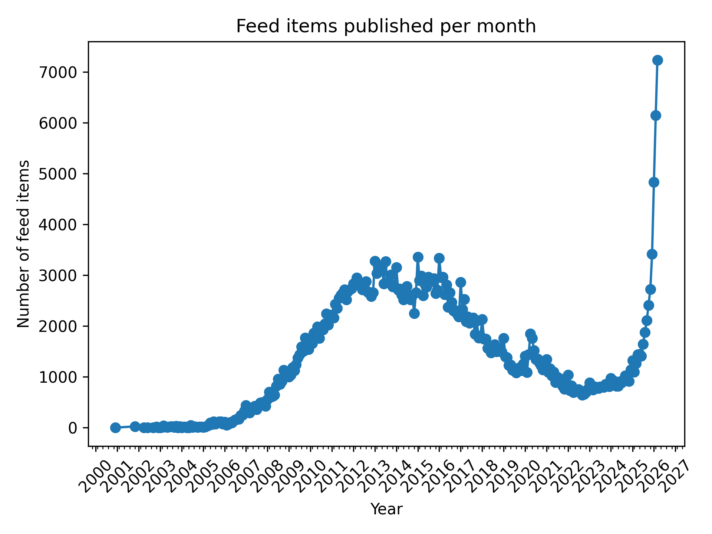
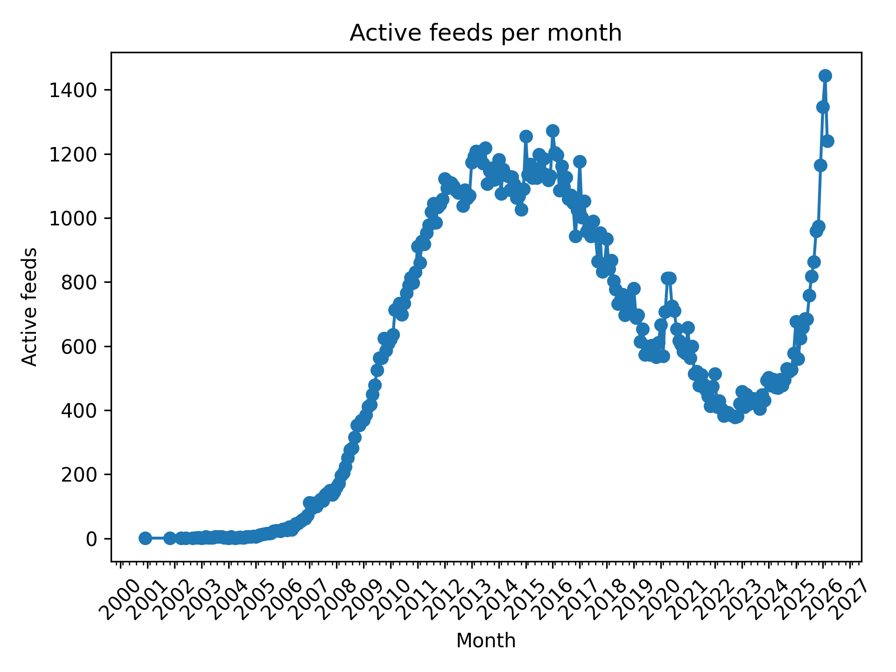
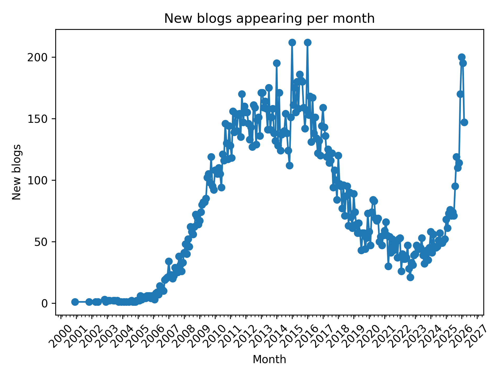
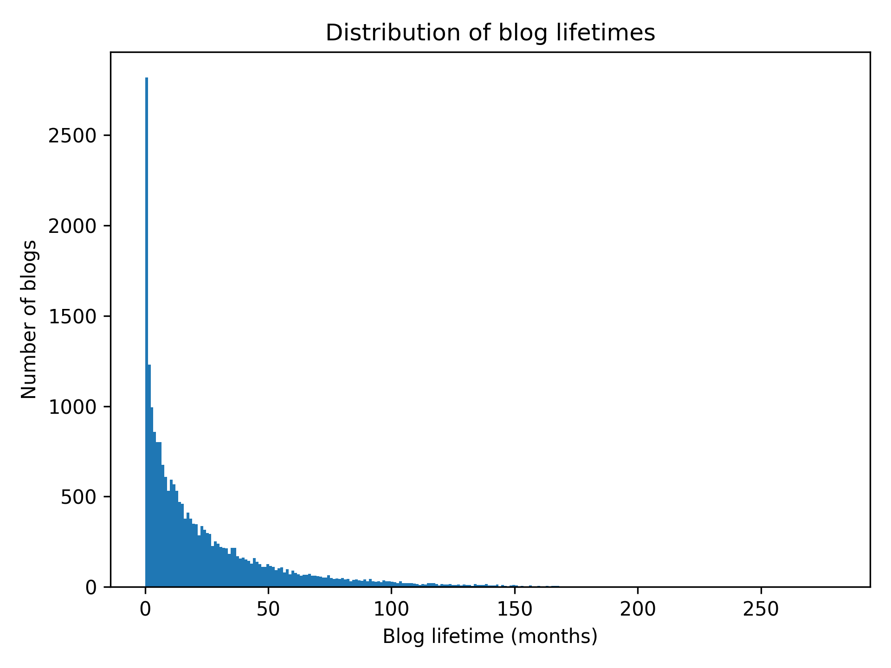

# Registering blog activity

<small>HTML generated with `pandoc -f gfm -t html README.md -o README.html`</small>

We need to understand how blog activity is distributed as a function of time. Given our dataset of 20k+ blogs, which percentage was active after, let's say, 2020? And in 2025/2026?

By defining a metric for activity we can start measuring whether blog activity is increasing or decreasing and categorizing blog by time period.

## Collecting blog post information

We created a new pipeline based on the `process-feeds` command on the backend/ module.

The pipeline goes through blogs registered with crawl status of `verified` and `crawled` and fetches its rss feeds.

On each feed it saves the following information for each listed post:

- post title
- post guid (uniquely identifies the post in the feed)
- post published date
- post URL
- post content (when available)

please note that even when present, the post content might be truncated or otherwise incomplete.

## Parcial results and initial analysis

As of 15/03/2026 we have the following results:

- 24182 unique blogs with `verified` or `crawled` status.
- 22294 blogs have at least one associated post.
- 414357 unique blog posts.

### Unique blog posts per month-year

<small>Generated with the `feed_items_per_month.py` script.</small>

If we adjust the data slightly, we can find out how many blogs published at least one post in a given month.

This should theoretically reduce the impact of individual blogs that post way above the mean.

<small>Generated with the `community_activity.py` script.</small>

Dá pra notar que o pico de postagens em 2025-2026, que estava muito acima do número de postagens visto no intervalo de 2010-2017, dá uma boa reduzida quando contamos apenas um post por blog. Isso indica grande atividade de um número reduzido de blogs. Uma possível explicação é a facilidade em automatizar a geração de conteúdo.

### Blog creation per month

When are new blogs being created? We can answer this (indirectly) by querying the month in which each blog has made their first post.

<small>Generated with the `new_blogs_per_month.py` script.</small>

Keep in mind that the rss feeds might not include the actual first post from each blog (nor the latest). We are actually measuring the first _observed_ activity.

### Blog activity interval

For how long do blogs stay active?

Using the interval between the first and latest post as our metric, we find the following distribution:

<small>Generated with the `blog_lifetime.py` script</small>

The longest blog in activity has been posting for over 23 years!

As expected, most blogs have a very brief lifetime. What surprised me is that most blogs are in the 1 month to 5 years interval (I assumed most blogs would have a single post).

- 1992 blogs have a single post (0 months lifetime)
- 8568 blogs lived from 1 month to 1 year
- 6651 blogs lived from 1 year to 3 years
- 2657 blogs lived from 3 to 5 years
- 2019 blogs lived from 5 to 10 years
- 406 blogs lived more than 10 years

